# Cancer Stage Prediction Web App

This project is a Flask-based web application that predicts the **cancer stage** of a patient using a machine learning model trained on global cancer patient data (2015–2024).

## 🚀 Features

- Predicts cancer stage based on user input
- Uses both numerical and categorical patient data
- Interactive web interface built with Flask
- Model trained using scikit-learn
- AJAX support for real-time prediction

## 🧠 Machine Learning Model

- Model Type: Classification
- Framework: Scikit-learn
- File: `cancer_stage_model.pkl`

## 🖼️ App Preview

<p align="center">
  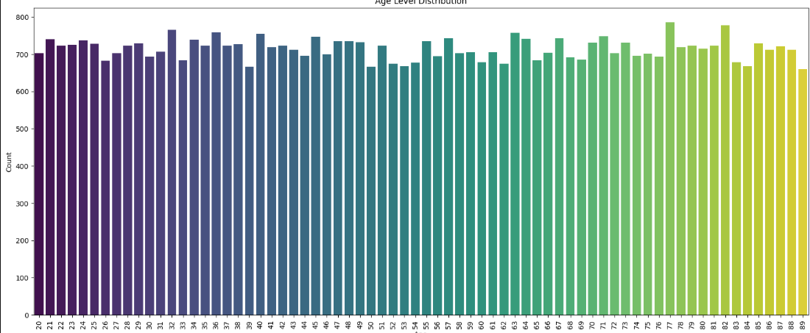
  
  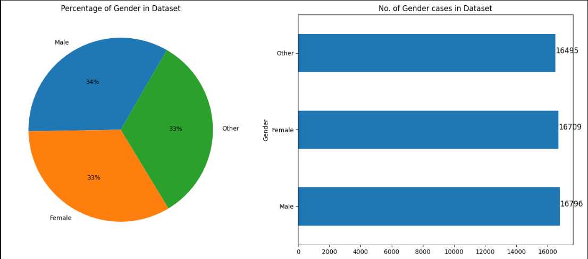
  
  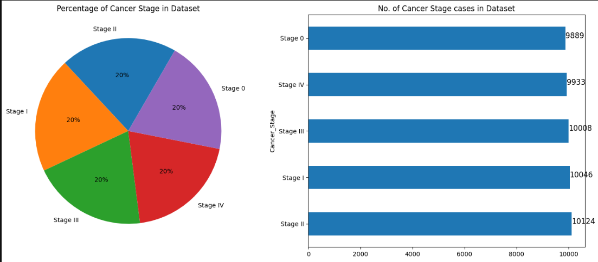
  
  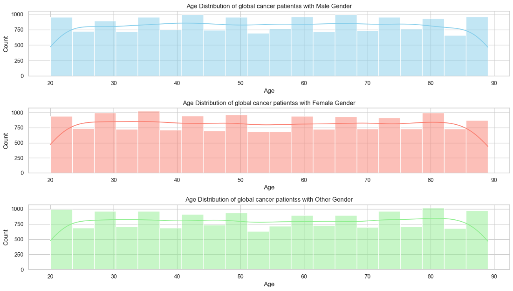
  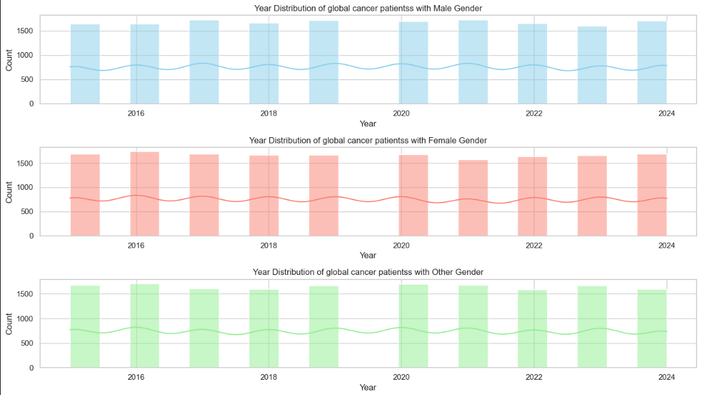
  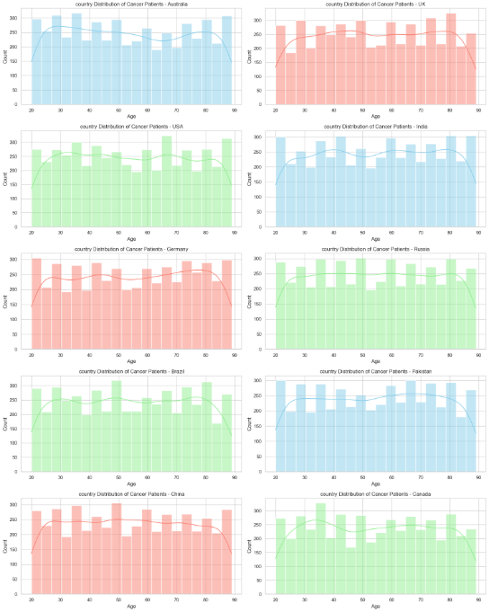
  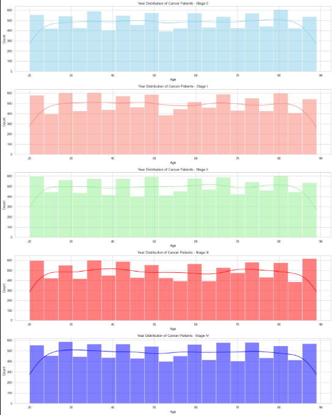
  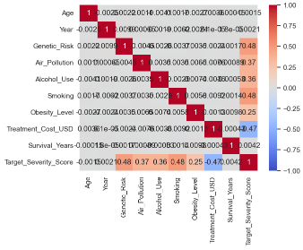
  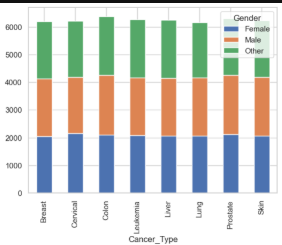
  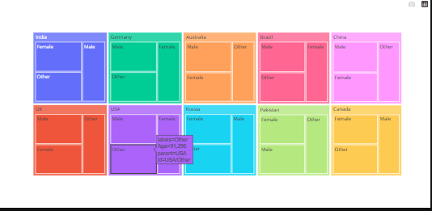
  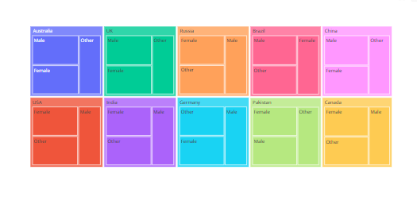
  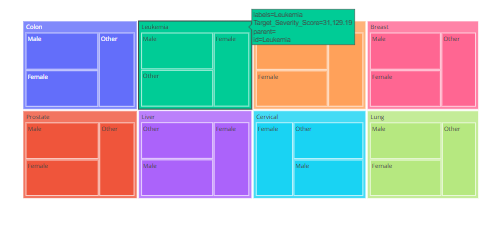
  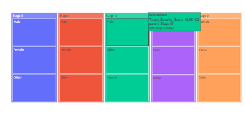
  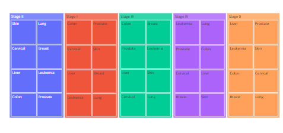
  
  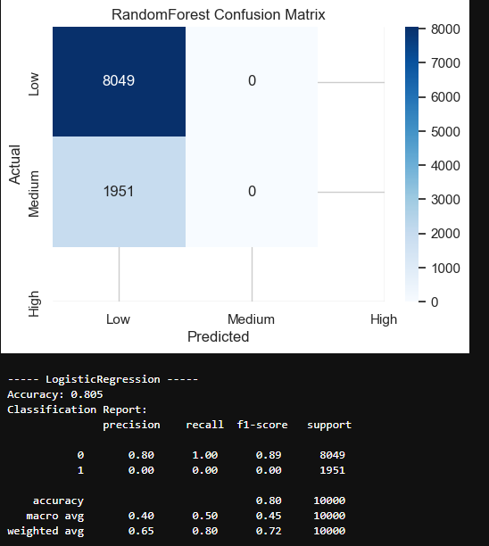
  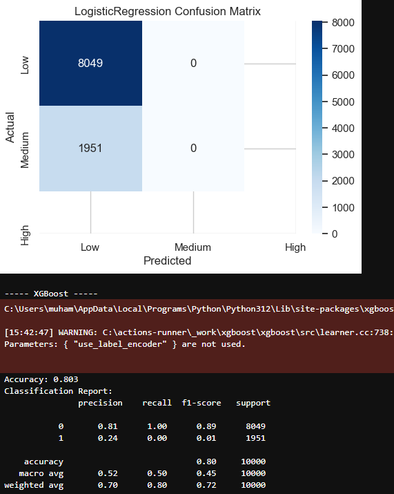
  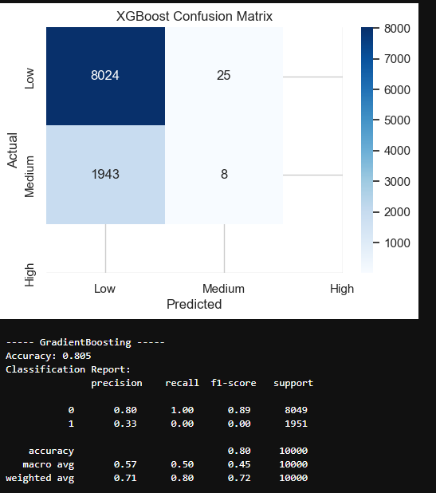
  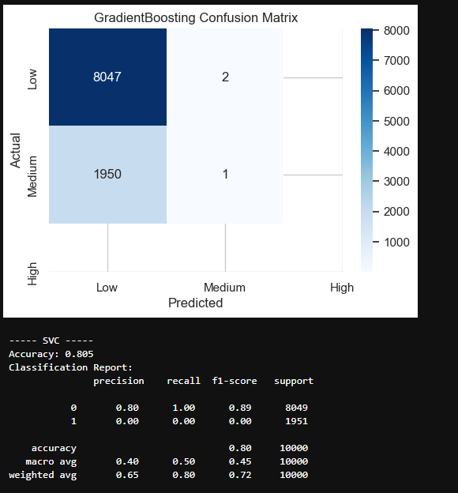
  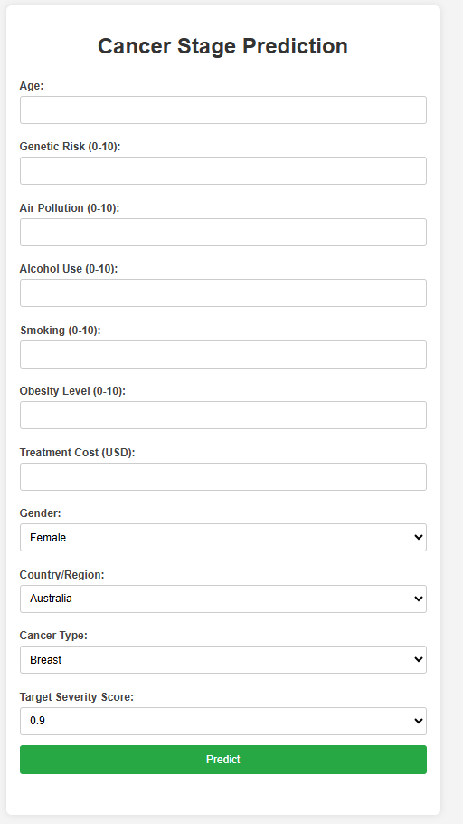
</p>

## 🗃️ Dataset

- File: `global_cancer_patients_2015_2024.csv`
- Features include:
  - Numerical: Age, Genetic Risk, Air Pollution, Alcohol Use, Smoking, Obesity Level, Treatment Cost (USD)
  - Categorical: Gender, Country/Region, Cancer Type, Target Severity Score

## 🛠️ Requirements

Install dependencies using:

```bash
pip install -r requirements.txt
